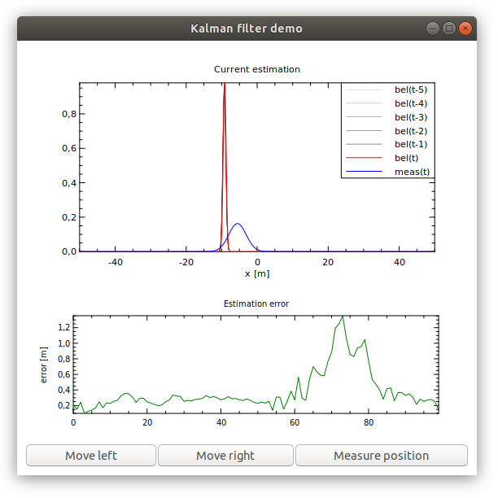

# Kalman filter demo

A demo application for the one-dimensional case of the _Kalman filter_ algorithm.

### Test execution

To execute the tests without the sporadic tests (random tests) execute the Tests module with the following arguments:

`~[random-test]`

### Build

You will need _gtkmm_ and _Gtkmm-PLplot_ in order to build.

To install gtkmm on linux try this:

`sudo apt install libgtkmm-3.0-dev`

If it does not work, check out the _Installation_ section of the gtkmm documentation.

Gtkmm-PLplot has packages for various linux distributions.
